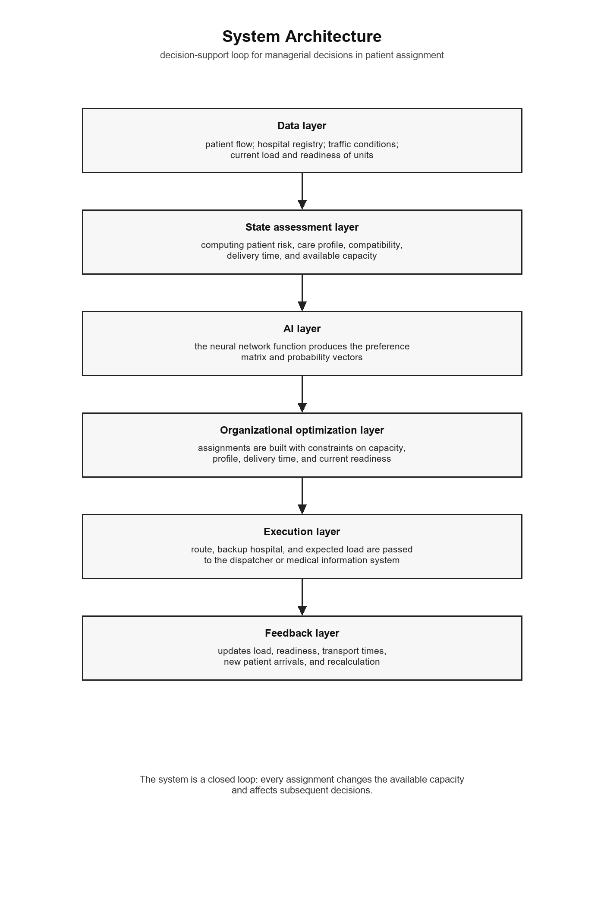
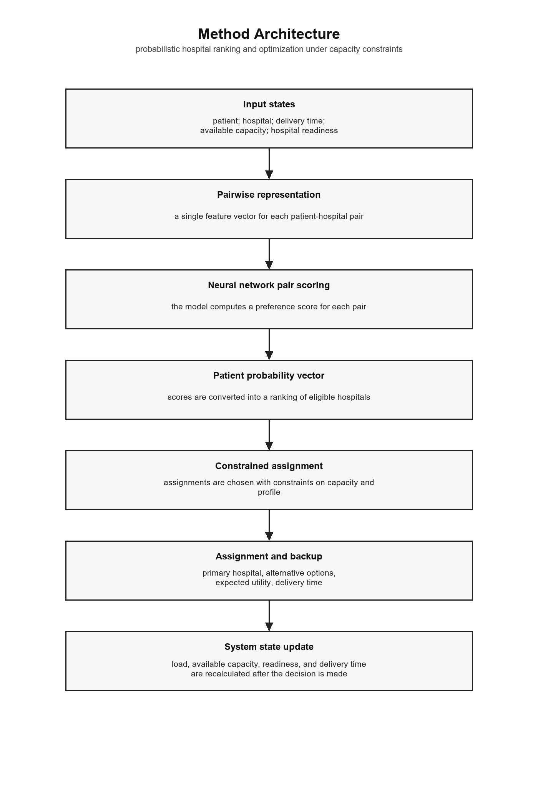
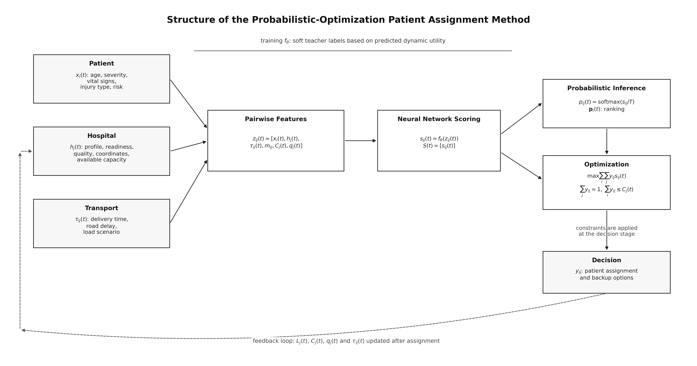
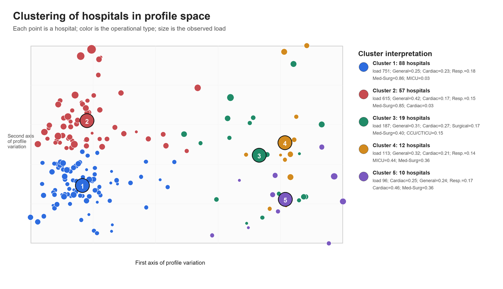
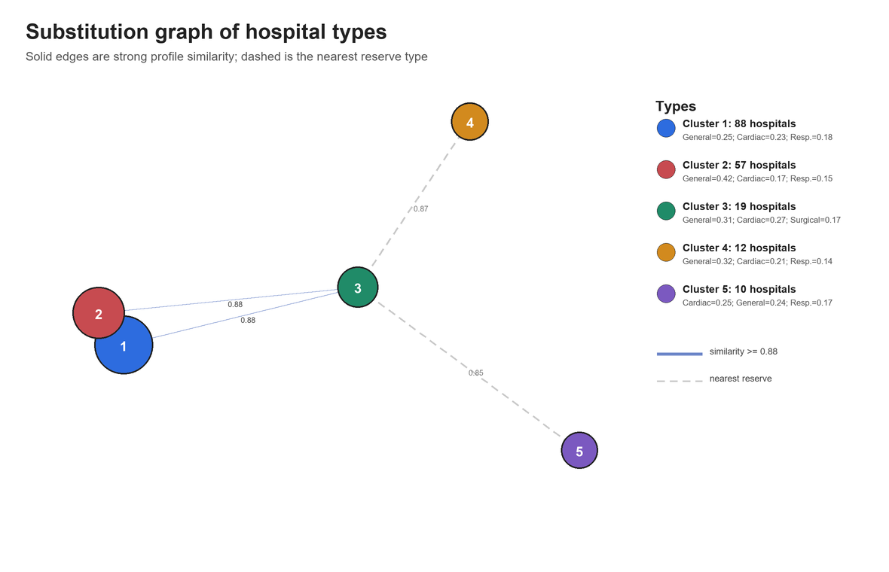
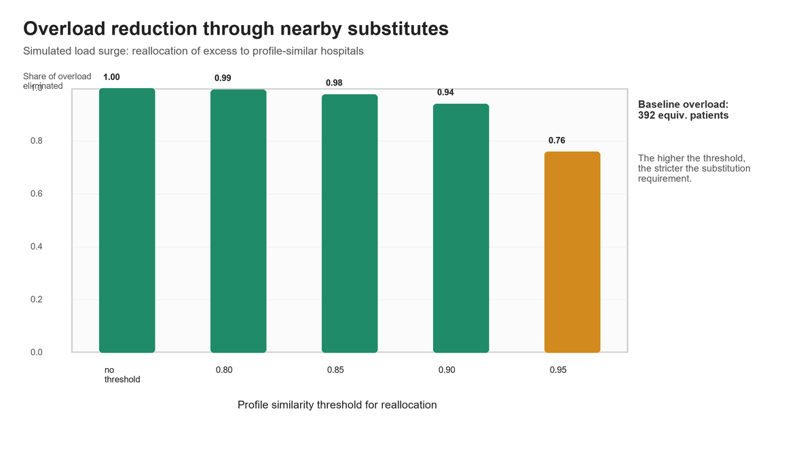
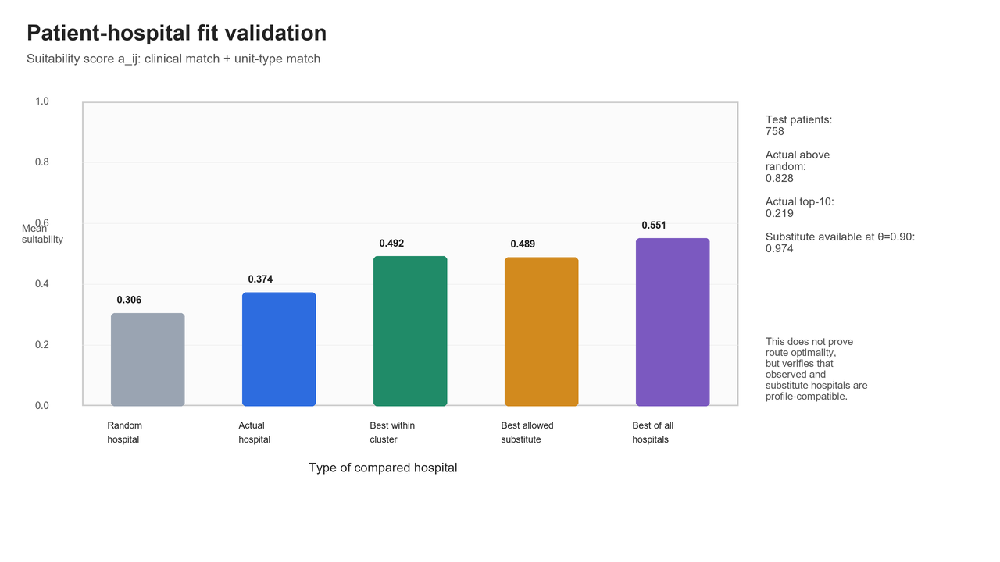

# Dynamic TRISS and Probabilistic Hospital Patient Assignment

A two-stage decision-support method for routing emergency patients —

`patient → time-dependent risk forecast → patient-hospital utility matrix → optimal assignment`

1. **Personalized dynamic assessment of patient condition** based on features available on-site or during the first hours of observation (age, GCS, SBP, RR, HR, shock index, TRISS/RTS derivatives).
2. **Probabilistic/optimization-based assignment of patients to hospitals** accounting for transport time, capacity, hospital profile, and predicted condition dynamics.

## Method architecture

<p align="center">
  
  
</p>
<p align="center">
  
</p>

## Results: hospital network clustering (eICU-CRD)

<p align="center">
  
  
</p>
<p align="center">
  
  
</p>

More charts are available in the `results_eicu_*`, `results_triss`, `results_mimic`, and `results_large_scale` folders.

## Repository structure

```
figures/                  architecture diagrams (PDF/PNG/SVG)
results*/                 charts for each experimental scenario (PNG/SVG/PDF)
*.py                      feature-extraction and experiment scripts
```

Key script groups:

- `mimic_*`, `eicu_*` — feature extraction and experiments on the MIMIC-III/IV and eICU-CRD demo datasets;
- `*_experiment.py` — patient assignment experiments (simulation-based and on real features).

## Data

The experiments use open PhysioNet demo datasets (MIMIC-IV Clinical Database Demo v2.2, MIMIC-III Clinical Database Demo, eICU Collaborative Research Database Demo). The dataset files themselves are **not included in this repository** — only the processing code and result charts.

## License

MIT — see [LICENSE](LICENSE).
